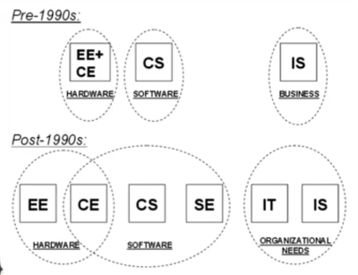
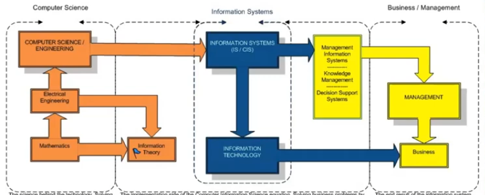

* Berbagai jurusan Sistem Informatika
* Sistem Informatika di Indonesia

# Perkembangan
* Era 1960an di Amerika
  Komputer mulai dimanfaatkan untuk menunjang proses bisnis.
  * Electrical Engineering (EE) mendalami hardware
  * Computer Science (CS) mendalami teori komputasi dan pengembangan software
  * Information System (IS) mendalami penggunaan hardware dan software untuk pemecahan masalah bisnis dan mendukung tujuan bisnis. 
* Era 1970an
  * Teknologi mikroprosesor mulai berkembang
  * Disiplin ilmu Computer Computer Engineering (Teknik Komputer = CE) memisahkan diri dari EE. CE mempelajari perancangan & pembangunan komputer dan perangkat lain yang sejenis, mencakup hardware, software, jaringan komunikasi, dan interaksi antar sistem.
  * Cakupan software semakin besar dan kompleks sehingga ilmu Software Engineering (Teknik Perangkat Lunak = SE) memisahkan diri dari Computer Science.
  * Software Engineering fokus pada metode perancangan dan pengembangan software yang efektif, dan handal.
  * Computer Sciencee fokus pada pengembangan teori pengetahuan baru terkait software.
* Era 1990an
  * Komputer semakin kecil dan terjangkau sehingga banyak perusahaan banyak menggunakan komputer.
  * Muncul disiplin ilmu Informatin Technology (Teknologi Informasi = IT)
  * IT fokus pada teknologi yang digunakan untuk mengolah informasi yang dibutuhkan organisasi.

# Fokus Disiplin Ilmu Sistem Informasi
* SI mengumpulan, proses, penyimpanan, analisa, dan distribusi informasi untuk tujuan tertentu.
* Mempelajari konsep, prinsip dan proses aktifitas
* Perancangan, pengembangan, operasional dan pemeliharaan proses bisnis, sistem dan infrastruktur pendukung proses-proses organisasi (termasuk di dalamnya Manajemen Informasi).
* Pengembangan, Implementasi, dan Menajemen sumber daya dan layanan IT.

| Sistem Informasi | Ilmu Komputer & Teknik Informatika | 
| --- | ---|
| Konteks: TI di sebuah sustem atau organisasi | Konteks: Proses algoritma untuk memprosesan informasi dan terkait masalah teknis |
| Fokus pada informasi yang dihasilkan TI dan proses bisnis/organisasi yang didukung TI untuk mencapai tujuan organisasi. TI hanya alat untuk mengumpulkan, memproses, dan menyampaikan informasi. | Fokus pada pembuatan teknologi |
| Lulusannya lebih disiapkan untuk bekerja dan menghadapi masalah-masalah dalam lingkungan organisasi | Lulusannya lebih disiapkan untuk mengatasi masalah teknologi dan proses algoritma, tidak memberi penekanan pada fungsi dan sistem organisasi. |
| Profesional di bidang SI berperan sebagai penghubung antara tim teknis dan management | Profesional TI/CS umumnya fokus pada tim teknis |

# Peran/pekerjaan di bidang IT
| Jabatan | Tugas |
| --- | --- |
| Chief Information Officer | Manajer IS peringkat tertinggi; bertanggung jawab atas semua perencanaan strategis di organisasi |
| IS Director | Mengelola semua sistem di seluruh organisasi dan sehari-hari operasi seluruh organisasi IS
| Information Center Manager | Mengelola layanan IS seperti help desk, hot line, pelatihan, dan konsultasi |
| Appplication Development Manager | Mengkoordinasikan dan mengelola proyek pengembangan sistem baru |
| Project Manager | Mengelola proyek pengembangan sistem baru tertentu |
| System Manager | Mengelola sistem tertentu yang ada |
| Operation Manager | Mengawasi operasi sehari-hari dari pusat data dan/atau komputer |
| Programming Manager | Mengkoordinasikan semua upaya pemrograman aplikasi |
| System Analyst | Antarmuka antara pengguna dan pemrogram; menentukan informasi persyaratan dan spesifikasi teknis untuk aplikasi baru |
| Business Analyst | Berfokus pada perancangan solusi untuk masalah bisnis; antarmuka erat dengan pengguna untuk mendemonstrasikan bagaimana TI dapat digunakan secara inovatif |
| Systems Programmer | Membuat kode komputer untuk mengembangkan perangkat lunak sistem baru atau memelihara perangkat lunak sistem yang ada
| Application Programmer | Membuat kode komputer untuk mengembangkan atau memelihara aplikasi baru aplikasi yang ada |
| Emerging Technologies Manager | Memprakirakan tren teknologi; mengevaluasi dan bereksperimen dengan yang baru teknologi |
| Network Manager/Administrator | Mengkoordinasikan dan mengelola jaringan suara dan data organisasi 
| Database Administrator | Mengelola database organisasi dan mengawasi penggunaan perangkat lunak manajemen database |
| Audiing/Computer Security Manager | Mengawasi penggunaan sistem informasi secara etis dan legal |
| Webmaster | Mengelola situs World Wide Web organisasi |
| Web Desainer | Membuat situs dan halaman World Wide Web |
| UI Designer | UI designer adalah orang yang mendesain teknis tampilan antarmuka sebuah aplikasi atau perangkat. |
| UX Designer | User Experience Designer (UX) melakukan design rancangan interaksi user dengan program sehingga berlangsung dengan jelas, intuitif dan sesuai kebutuhan user. |
