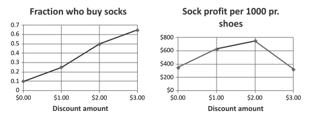

# 1.1 NILAI INFORMASI

Pertimbangkan tiga skenario bisnis ini.

SKENARIO 1

Sebuah pabrik mainan mendapat pesanan 5.000 gerbong. Dibutuhkan 20.000 roda untuk memproduksinya. Stoknya hanya 4.000 roda. Setidaknya harus memesan 16.000 roda lagi.

Kemungkinan Hasil A
Manajer kendali produksi menelepon agen pembelian yang menangani roda. Dia keluar seharian, jadi manajer kontrol produksi meninggalkan pesan suara. Ketika agen pembelian membalas telepon keesokan paginya, manajer kontrol produksi berada di depan pabrik, jadi dia meninggalkan pesan suara. Mereka berbicara sehari setelah itu. Agen pembelian kemudian memanggil tiga pemasok dari siapa produsen mainan tersebut telah membeli roda di masa lalu. A tidak lagi berbisnis. Perwakilan penjualan B baru saja pergi berlibur selama tiga minggu. Dia meninggalkan pesan suara untuk penjual C. Penjual merasakan keputusasaan dalam pesan agen pembelian dan mengutip harga 25% lebih tinggi dari biasanya. C mendapat pesanan bagaimanapun juga.

Kemungkinan HasilB
Sistem perencanaan produksi perusahaan mainan menghitung kebutuhan dan mengirimkan pesan elektronik ke departemen pembelian. Perangkat lunak workfow di departemen pembelian mengarahkan permintaan ke agen pembelian, tetapi akan mengalihkannya ke manajernya jika dia tidak memprosesnya dalam waktu 24 jam. Dia memprosesnya keesokan paginya, mengirimkan pesan Permintaan Penawaran elektronik ke tiga perusahaan yang telah memasok roda di masa lalu. Dia mendapat tawaran kembali dari keduanya yang masih berbisnis. C mengutip harga standar. B, yang perwakilan penjualannya sangat ingin menutup beberapa bisnis sebelum pergi berlibur selama tiga minggu, menawarkan diskon 20%. Kali ini, B yang mendapat perintah.

SKENARIO 2
Seorang profesor perguruan tinggi senang memecahkan teka-teki dan sering membeli buku teka-teki secara daring. Dua toko buku mendapatkan buku teka-teki baru yang diedit oleh Will Shortz, yang terkenal dengan teka-teki berkualitas tinggi.

Kemungkinan Hasil A
Penjual A memberi harga buku dengan diskon untuk menarik bisnis. Itu menempatkan mereka di rak dan situs webnya, dan menunggu orang masuk dan membelinya atau memesannya secara online. Beberapa melakukannya, tetapi profesor tidak kebetulan mengunjungi toko atau situsnya, jadi dia tidak melihatnya.

Kemungkinan HasilB
Penjual B menyimpan daftar orang yang telah memesan buku secara online sebelumnya, diindeks berdasarkan kategori. Ini mengirimkan email kepada orang-orang yang membeli buku teka-teki untuk memberi tahu mereka tentang buku baru tersebut. Profesor itu memesan buku dari toko yang mengiriminya email. Dia tidak ingin meluangkan waktu untuk memeriksa sumber lain, jadi dia tidak tahu toko lain akan menjualnya dengan harga lebih murah $2.

SKENARIO 3
Sebuah toko peralatan atletik menjual kaus kaki lari yang ringan dan menyerap benturan seharga $10 per pasang, di mana $3,50 adalah margin keuntungannya. Pemilik toko mengira banyak orang yang membeli sepatu olahraga juga bisa menggunakan sepasang kaus kaki tersebut, jadi dia merencanakan promosi kaus kaki untuk dikaitkan dengan penjualan sepatu.

Kemungkinan Hasil A
Toko tersebut menawarkan kepada pembeli sepatu olahraga kupon diskon $3 untuk sepasang kaus kaki ini. Penjualan kaus kaki naik banyak. Manajer memutuskan untuk menyertakan kupon kaus kaki $3 untuk setiap pasang sepatu olahraga yang mereka jual.

Kemungkinan HasilB
Toko mencoba tiga percobaan satu minggu: kupon untuk $1, $2, dan $3 dari sepasang kaus kaki ini. Mereka memplot penjualan kaus kaki seperti pada Gambar 1.1(a). Mereka tahu volume penjualan bukanlah tujuan mereka: mereka menjual lebih banyak kaus kaki dengan diskon lebih tinggi, tetapi mereka juga menghasilkan lebih sedikit keuntungan per pasang. Mereka membuat grafik keuntungan pada kaus kaki seperti pada Gambar 1.1(b). Berdasarkan informasi ini, manajer memutuskan untuk menyertakan kupon diskon $2 untuk setiap pasang sepatu olahraga.

_Gambar 1.1 (a) penjualan kaos kaki, (b) analisa keuntungan_

**BAGAIMANA KITA MEMAHAMINYA**

Pikirkan tentang hasil ini. Dalam setiap skenario, bisnis mana yang akan berjalan lebih baik? Orang atau organisasi yang menggunakan informasi secara efektif lebih mungkin tampil di depan. Informasi dapat menjadi lebih penting daripada fitur produk: produk dengan kemampuan yang lebih rendah atau harga yang lebih tinggi dapat terjual lebih banyak daripada produk yang lebih baik, jika calon pembeli mengetahui apa yang dapat dilakukannya dan bagaimana cara menggunakannya.

Ketiga skenario ini mengilustrasikan tiga cara utama informasi dan sistem informasi membantu perusahaan berhasil: menghubungkan bagian-bagian organisasi, menghubungkan organisasi dengan pelanggan dan pemasok, dan membantu membuat keputusan yang lebih baik. Sebuah bab dikhususkan untuk masing-masing konsep kunci ini nanti dalam buku ini.

<blockquote>

<b>EFEKTIVITAS VS EFISIENSI</b>

Anda baru saja membaca bahwa bisnis harus menggunakan informasi secara efektif. Anda juga pernah mendengar orang berbicara tentang efisiensi. Seorang pebisnis harus tahu bedanya.

<b>Efektivitas</b> menggambarkan seberapa baik Anda mencapai tujuan Anda. Untuk mengukur efektivitas, Anda harus tahu apa tujuan itu.

<b>Efisiensi</b> menggambarkan berapa banyak output yang Anda dapatkan dari setiap unit input. Untuk mengukur efisiensi, Anda harus dapat mengukur input dan output.

<b>Contoh:</b> Anda harus memilih antara dua paket perangkat lunak untuk mempersiapkan SPT penghasilan Anda. Yang satu sulit digunakan, dengan prosedur entri data yang rumit yang harus diikuti dengan tepat, dan tidak dapat mempersiapkan pengembalian negara Anda. Namun, ini sangat efisien: berjalan dengan cepat di komputer lama Anda yang lambat. Yang lainnya memiliki antarmuka yang jauh lebih modern, dan dapat menyiapkan pengembalian untuk negara bagian A.S. mana pun, sehingga menyelesaikan pekerjaan dengan lebih efektif—namun berjalan lambat di komputer Anda. Itu tidak efisien. Anda perlu memutakhirkan komputer Anda atau menghabiskan banyak waktu menunggunya menyelesaikan perhitungannya. Anda harus mengetahui tujuan dan pengorbanan Anda sebelum memilih.
</blockquote>

Mengapa ini penting? Dengan sistem informasi, Anda memperhatikan efektivitas dan efisiensi. Idealnya, Anda menginginkan keduanya. Namun, seringkali ada timbal balik di antara mereka. Kepentingan relatif mereka dapat bervariasi dari satu situasi ke situasi berikutnya. Anda harus memahami perbedaan antara kedua konsep tersebut untuk membuat pertukaran tersebut dengan benar.

> **Peran Anda:** Pengorbanan ini adalah keputusan bisnis. Mereka tidak boleh dibuat atas dasar teknis. Faktor teknis terlibat, tetapi keputusan akhir harus dibuat oleh pebisnis seperti yang akan Anda lakukan setelah Anda lulus.

(terakhir PDF hal 10)